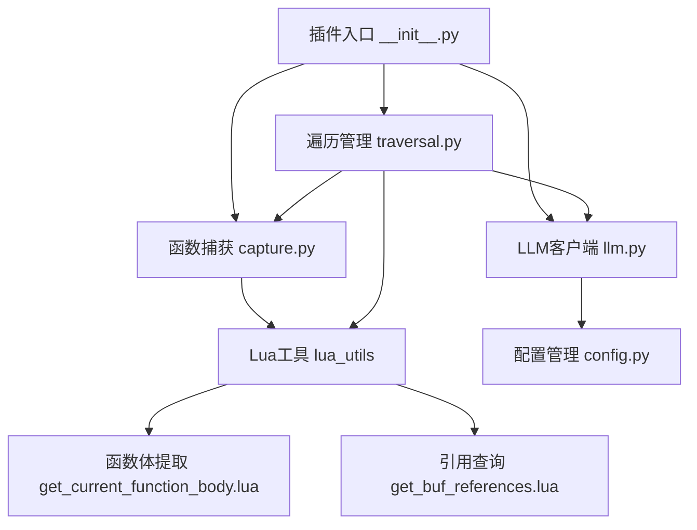
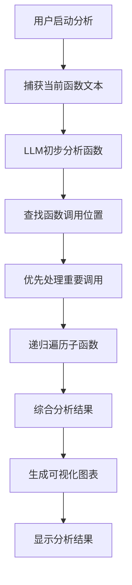

# CallGraphite

CallGraphite 是一个 Neovim 插件，旨在通过深度优先搜索（DFS）方式探索大型代码库，收集函数体并将其发送到语言模型（LLM）进行分析。该插件利用语言服务器协议（LSP）和树解析器（Tree-sitter）技术，自动识别和分析函数调用关系，生成调用图和流程图，帮助开发者快速理解复杂代码结构。

## 功能特点

- **函数文本捕获**：使用 Tree-sitter 精确识别和提取当前光标下的函数体
- **深度优先遍历**：通过 LSP 引用查询，自动遍历函数调用关系
- **LLM 智能分析**：将函数代码发送到 LLM 进行分析，识别关键调用和变量
- **两阶段分析**：初步分析单个函数，然后基于子调用结果进行综合分析
- **可视化展示**：生成 ASCII 和 Mermaid 格式的调用图和流程图
- **导航历史**：维护跳转栈，支持在分析过的函数间前进和后退导航
- **结果缓存**：缓存分析结果，避免重复请求，提高效率

## 项目架构





## Installation

Use your favourite Neovim plugin manager. Examples are shown below.

### Using Plug

```vim
Plug 'mikewong23571/CallGraphite'
```

After running `:PlugInstall`, restart Neovim and run `:UpdateRemotePlugins` so the Python plugin is registered.

### Using packer.nvim

```lua
use {
  'mikewong23571/CallGraphite',
  run = ':UpdateRemotePlugins'
}
```

### Congiguration

插件默认使用 ~/.config/callgraphite/config.json 作为配置文件。您可以创建此文件并自定义以下选项：

```json
{
  "llm": {
    "endpoint": "https://api.openai.com/v1/chat/completions",
    "api_key": "your-api-key-here",
    "model": "gpt-3.5-turbo",
    "temperature": 0.3,
    "max_tokens": 500
  },
  "visualization": {
    "enabled": true,
    "ascii_graph": true,
    "mermaid_graph": true,
    "mermaid_flow": true,
    "max_depth": 5
  },
  "analysis": {
    "comprehensive": true,
    "cache_results": true
  }
}
```

## Usage

Open a project supported by your LSP. Then run the command:

```
:CallGraphite
```

The plugin traverses the files via LSP, extracts each function body and prints the text that would be sent to the LLM. You should see output similar to:

```
Collected 42 functions
Uploading to LLM...
```

The exact output depends on the LLM integration, but you can expect a summary once all functions are processed.

You can also capture the text of the function under the cursor using:

```
:CaptureFunction
```

This command uses tree-sitter to locate the nearest parent function and prints its source.

Navigation through analysed locations is possible using:

```
:CallGraphiteBack
:CallGraphiteForward
```

These commands move through the internal jump stack maintained by the plugin, mirroring Neovim's own jump list.


## Running Tests

Install the Python dependencies and run pytest:

```bash
pip install -r requirements.txt
pytest
```

## License

This project is licensed under the Apache License 2.0. See `LICENSE` for details.
